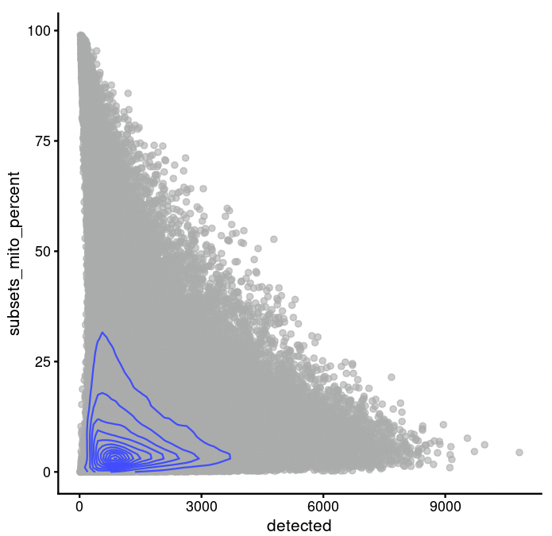

class: black-out

# Biomedical research questions

My work is focussed on cancer-immune relationship
--
.pull-left[
```{r echo=F, out.width = 500, out.height=330}
xaringanExtra::use_tile_view()

```
]
--
.pull-right[
## Specific biomedical questions of interest
   - How many immune cells are present in a cancer biopsy?
   - What states are the cancer and immune cells in?
   - What type of variability exists in cancer cells upon perturbation (e.g. chemotherapy treatment)?
]

---

# Exponential increase in sequencing available

.pull-left[
```{r echo=F, out.width = 500}

```
```
Source: Nature.com
```
]

???
Moores law = # of transistors on an integrated circuit doubled every other year
--
.pull-right[
### Publicly deposited sequence data (TB)
```{r echo=F, out.width = 700}

```
```
Source: ncbiinsights
```
]

--

### Datasets of this magnitude require robust processing and analysis pipelines

---

# How not to do reproducible research
.oneThirdsPullLeft[
```{r echo=F, out.width = 300}

```
```
Handling robot. Source: protocols.io
```
]

.twoThirdsPullRight[
Obtained ~1,000 sequencing samples from diverse cancer models using this robot.
{{content}}
]
--

- Submitting data cleaning jobs manually.

{{content}}

--
```
    for f in data/exp1/*; do sbatch --wrap="command param1 ..."; done
```
  
{{content}}
???
  - Five months later you will ask "What parameters did I use again?"
--

-  Re-write code and commands for each new experiment

{{content}}

--

- Rscripts/functions that accomplished individual tasks, but were not linked to the project

{{content}}

--

### Other issues with this approach

- Changes in upstream steps (e.g. data processing) do not trigger a re-run of subsequent steps
- Code reusability across experiments was poor
{{content}}

---

# General desirable characteristics of a pipeline

- Reproducible

  - Setting a seed
  - Relative paths

--
- Only write your code once

  - E.g. re-use the same clustering script changing just the clustering parameters

--
- Tie scripts into a single executable workflow

    - Create a results report at the end
--

- Automatically re-run workflow sections if there are upstream changes
```
      Download data -> cluster data -> create figure
```

--

- Re-use the same pipeline on different datasets

    - Could be a complex data processing pipeline
--
    - Challenge: 99% of the code remains the same, only parameters change

???
I imagine this list holds quite well outside the biomedical domain too

---

# Concrete biomedical example in single-cell RNA-Sequencing

Single-cell RNA-Sequencing: Sequence individual cells and understand their heterogeneity

--
   - How many immune cells are present in a cancer biopsy?
   - What states are the cancer and immune cells in?
   - What type of variability exists in cancer cells upon perturbation (e.g. chemotherapy treatment)?

--

.pull-left[
### Concrete biomedical example in single-cell RNA-Sequencing

1. Filter out dead and damaged cells

  - Based on the number of overall reads and percentage of reads from mitochondrial genes
  - Threshods are very sample dependent: tumour samples have higher % of mitochondrial reads
  
]

???

Dead and damaged cells depend on sample preparation.

Because of technical reasons, dead/damaged cells have a higher proportion of dead cells

--
.pull-right[
```{r echo=F, out.width=357, out.height=350}

```
]

---

# General analysis pipeline steps

.pull-left[
1. Filter out dead/damaged cells
2. Normalize data
{{content}}
]
--
3. Cluster cells
{{content}}
--
4. Assign each cluster to cell types based on the expression of certain markers
{{content}}
--
  - Some clusters are impure and contain multiple cell types
{{content}}
--
  - Analysis can be aided by creating scatterplots of specific markers
{{content}}
--

## Data dependent parameters
1. number of detected reads & % mitochondrial genes
2. clusters that need re-clustering
3. markers to correlate
{{content}}

---

# General analysis pipeline steps

.pull-left[
1. Filter out dead/damaged cells
2. Normalize data
3. Cluster cells
4. Assign each cluster to cell types based on the expression of certain markers
  - Some clusters are impure and contain multiple cell types
  - Analysis can be aided by creating scatterplots of specific markers

## Data dependent parameters
1. number of detected reads & % mitochondrial genes
2. clusters that need re-clustering
3. markers to correlate
]

.pipelineRequirementsBox[
### Summary of requirements
- Reproducible

- Create a single executable workflow

- Re-run the same script over different samples/parameters

- Automatically re-run if there are upstream changes

- Reuse the same pipeline despite data-dependent parameter diffences between datasets
]

---

# Snakemake introduction

**Snakemake is a Python based workflow manager to create reproducible and scalable analyses**

--

Snakemake is based on rules: 
- Each analysis step can be implemented as a human readable snippet
--

- Workflows can run on local, cluster or cloud environments without needing to modify the workflow

--

```
rule plot_amazing_figure:
  input:
    data = 'output/data/my-processed-data.csv'
  output:
    figure = 'figures/my-amazing-figure.pdf'
  script:
    'scripts/make-my-figure.R'
```

--

- Snippets can be tied together to create a complete workflow


???
- Input
- Output
- What generates it

Can list as many input/output files as I like

---
# Snakemake introduction
.pull-left[
```
rule all:
  input:
    'output/data/my-processed-data.csv',
    'figures/my-amazing-figure.pdf'

rule plot_amazing_figure:
  input:
    data = 'output/data/my-processed-data.csv'
  output:
    figure = 'figures/my-amazing-figure.pdf'
  script:
    'scripts/make-my-figure.R'

rule download_my_data:
  params:
    website: 'www.mywebsite.com/my_csvfile.csv'
  output:
    csv = 'output/data/my-processed-data.csv'
  shell:
    'curl {params.website} -o {output.csv}'
```
]

--
.pull-right[
```{r echo=F, out.height=400, out.width=316}

```
]

---

# Executing the same script over multiple samples/parameters

```
rule all:
  input:
    expand('figures/my-amazing-figure-{samples_list}.pdf', samples_list = ['s1', 's2', 's3'])
```

--
```
rule plot_amazing_figure:
  input:
    data = 'output/data/my-processed-data-{samples_list}.csv'
  output:
    figure = 'figures/my-amazing-figure-{samples_list}.pdf'
  script:
    'scripts/make-my-figure.R'

rule download_my_data:
  params:
    website: 'www.mywebsite.com/my_csvfile-{samples_list}.csv'
  output:
    csv = 'output/data/my-processed-data-{samples_list}.csv'
  shell:
    'curl {params.website} -o {output.csv}'
```

???

Snakemake will also re-run the sample if there have been changes upstream.

Example, say I download my data again, then plotting would run again too


If the output of a rule is not specified in rule all, the rule itself will not cause any errors but will also not run

---

# Configuration & conditional rule execution

- A configuration file can easily be added to each Snakefile 

```
    configfile: 'config.yaml'
```

--

Good place to keep:
- File paths to data/software binaries
- Data filtering parameters

--

## Conditional rule execution

.pull-left[
```
checkpoint gene_expression_in_clusters:
    input:
        "output/{cluster}.txt"
    params:
        config['cluster_parameter']
    output:
        "figures/gene1_expression_in_{cluster}.png"
    script:
        "plotGeneExpression.R"
```
]
--

.pull-right[
- Useful when the output is data-dependent and can only be determined after other parts of the workflow have completed

- E.g. Plotting the expression of a gene in all clusters
{{content}}
]
--
- **Does not work when subsequent results depend on _manual_ inspection of plots**

---
class: conditionalRule-code
# Conditional rule execution
How can we build pipelines that can be reused (e.g. to process a dataset) when steps are 
1. data dependent and 
2. require manual inspection of results to determine next steps

--

.oneThirdsPullLeft[
```{r echo=F, include=T,out.width=357, out.height=350}

```
]

--

```
configfile: 'my_config.yaml'

my_results_dict = {
  'downloaded_data': 'output/data/downloaded-data.csv'
}
```
--
```

if config['dead_cells'] is not None:
  my_results_dict['my_figure'] = 'processed-data.csv'
```
--
```

rule all:
  input:
    my_results_dict.values()
```
--
```

rule process_data:
  input: 
...
```

---

# Create an HTML report

```
snakemake --report my-amazing-report.html
```
--

```{r echo=F}

```

---

# Snakemake run statistics

```{r echo=F}

```

---

# Snakemake run config
.center[
```{r echo=F, out.width=800}

```
]

---

# Rule outputs

.center[
```{r echo=F}

```
]

---
# Summary

- Reproducible

  - Snakemake pipelines can be shared via github

--

- Create a single executable workflow

  - Snakemake ties together individual rules

--

- Re-run the same script over different samples/parameters

  - Can be accomplished with the `expand()` function

--

- Automatically re-run if there are upstream changes

  - Automatically done by Snakemake if files are changed

--

- Reuse the same pipeline despite data-dependent parameter differences between datasets

  - Checkpoints can be used if no human intervention is required
  - If/else statements can be used to add outputs to `rule all` when parameters must be determined manually

---
# Resources

Snakemake has support for:
- Docker containers
- Conda environments
- Wrappers for common tools
- Log outputs
- HPC specifications (e.g. # of threads or memory)

Snakemake tutorial: https://snakemake.readthedocs.io/en/stable/tutorial/tutorial.html

Snakemake documentation: https://snakemake.readthedocs.io/en/stable/index.html

Slides: https://michael-geuenich.github.io/2022_Toronto_workshop_reproducibility/

Contact: mgeuenich@lunenfeld.ca
